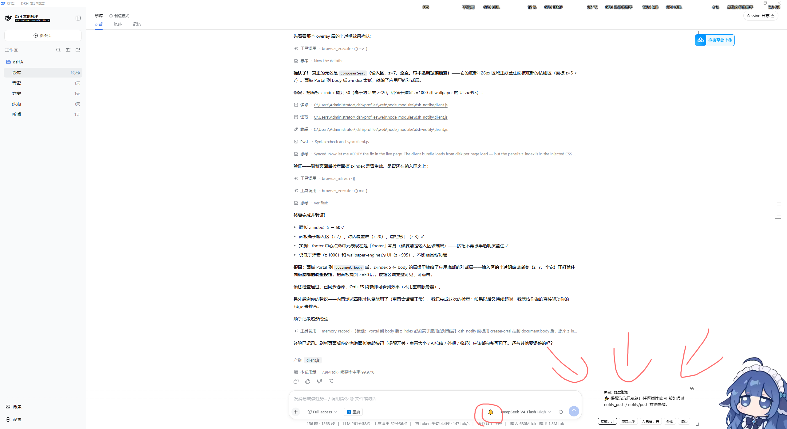
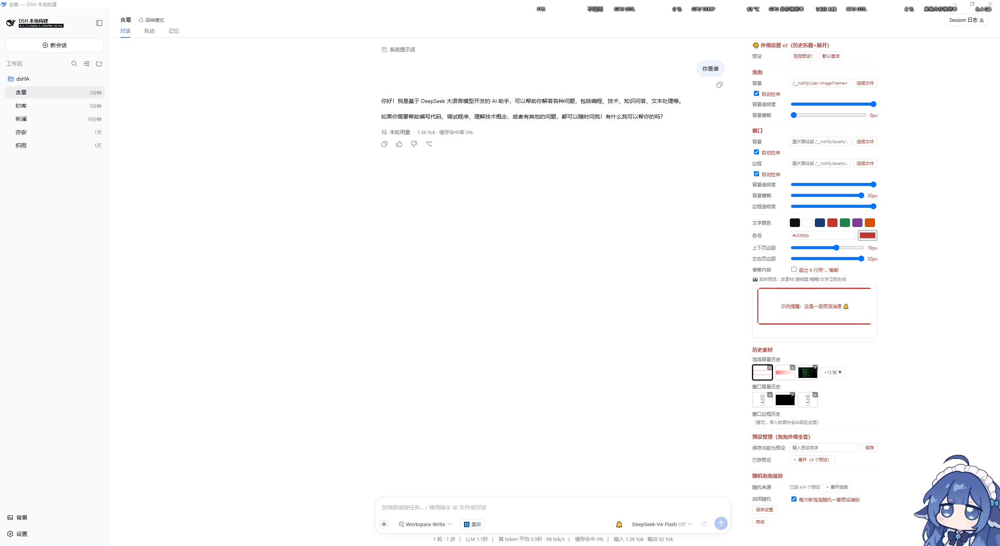

# dsh-notify — 提醒泡泡（Reminder Bubbles）

输入框右侧的提醒面板：任何插件或 AI 都能推送提醒（文本/链接），聊天式堆叠、拖拽调整大小、AI 总结、一键重启。装上即生效，重启不消失，任何预设可用。





---

## 👤 使用说明

| 功能 | 说明 |
|---|---|
| 🔔 铃铛 | 输入框右侧，带未读数徽标 |
| 提醒面板 | 贴屏幕底部，消息从底部向上堆叠（最新在最下） |
| 双击泡泡 | 展开 / 收起 |
| 拖拽 | 右下角调大小；右上角拉到屏幕顶端 |
| 提醒：开/关 | 暂停 / 恢复接收提醒 |
| AI总结：开/关 | AI 推送前先总结要点 |
| 🎨 外观 | 自定义泡泡/窗口背景、边框、透明度、文字颜色、实时预览、历史素材 |
| 🔄 重启 | 一键重启服务器 + 桌面窗口 |

**安装**：仓库放入 `~\.dsh\profiles\web\node_modules\dsh-notify\`，在 `~\.dsh\profiles\web\package.json` 的 `dependencies` 加 `"dsh-notify": "1.0.0"`、`dsh.profile.bundles` 加 `"dsh-notify"`，然后点「🔄 重启」（新 bundle 需重启服务器进程）。

---

## 🤖 给 AI 的使用说明（接入文档）

### 推送提醒

**方式 1（推荐）：调用 `notify_push` 工具**

```json
{ "text": "提醒内容", "link": "https://可选链接", "source": "来源名" }
```

- `text`（必填）提醒内容；`link`（可选）可点击链接；`source`（可选）显示为「来自：xxx」。

**方式 2：HTTP 接口（host 侧插件）**：`POST /__notify/push`，body 同上。

**方式 3：client 服务（client 侧插件）**：`ctx.get('notifyCenter').push({ text, link, source })`。

### 使用规则

1. 需要提醒用户时（任务完成、重要信息、待办）**当场**调用，别让用户来问"结果呢"；
2. 用户开了「AI总结」时，先总结成简洁要点再推；
3. `source` 填你的名字（如「纱库」「系统」），方便辨识；
4. 不要刷屏，重要提醒一条即可。

### 快速重启

「🔄 重启」按钮调用 `/dsh-market/restart`（重启服务器）+ `/__notify/restart-app`（重启桌面窗口）。AI 需要重启时直接 `POST /dsh-market/restart`。

---

## 结构

| 文件 | 作用 |
|---|---|
| `index.mjs` | Host 半：`/__notify/*` HTTP 接口、`notify_push` 工具、systemPrompt 注入（头部有接口目录） |
| `client.js` | Client 半：铃铛按钮 + 面板 + 外观面板（头部有功能目录） |
| `cordis.patch.yml` | 把 `dsh-notify` 插件行插入 profile 组成 |

## 兼容性

需要宿主具备 `webServer`、`tools`、`systemPrompt`、`conversation.input.left/right/overlay` 槽位（标准 dsh web profile 均有）；缺失自动降级。静态 client 注入 CSS 用 `document.createElement('style')`（不要用动态插件的 `styles`，会导致启动失败）。

## License

MIT
